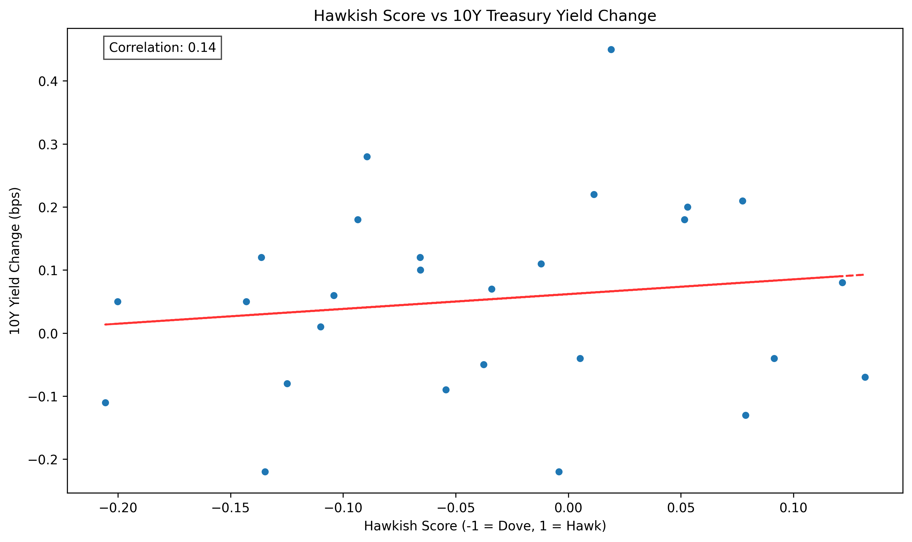
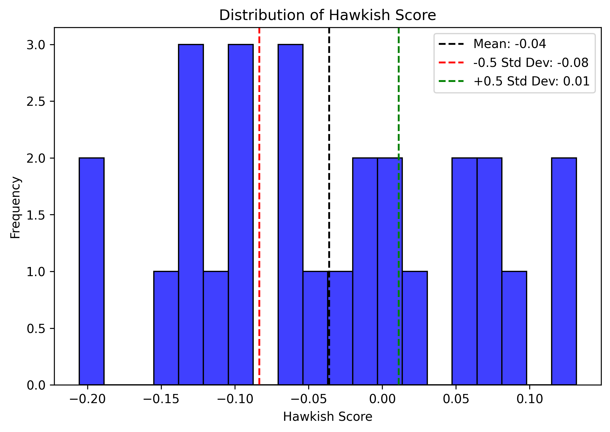
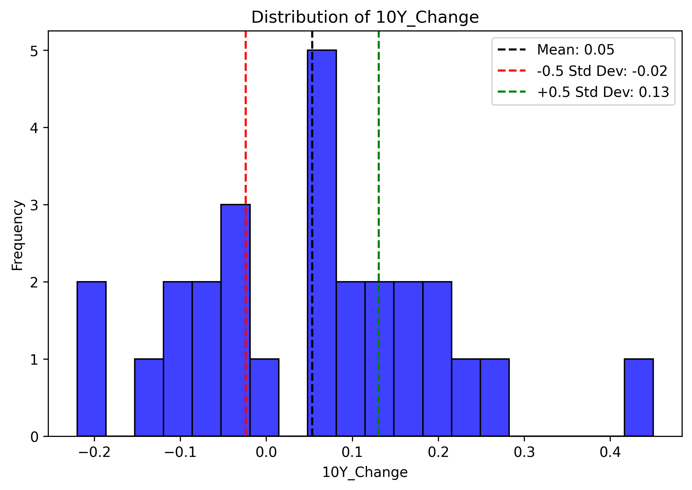
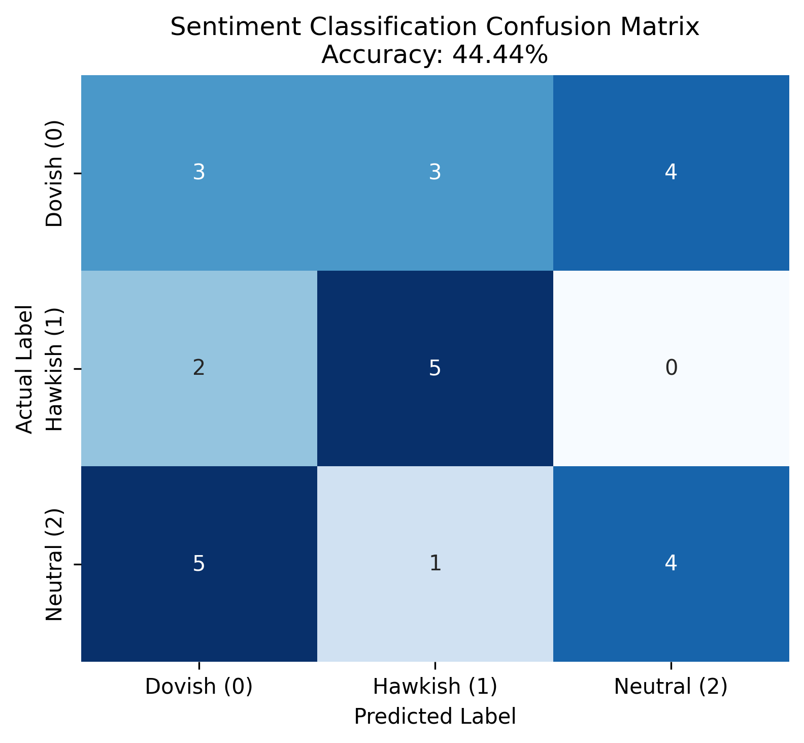

# Goal
This notebook analyzes the sentiment extracted from FOMC meeting minutes and compares it to bond market reactions using a combination of machine learning and large language models (LLMs). Specifically, we use a pretrained sentiment classification model from Hugging Face (ProsusAI/finbert) to quantify the tone of central bank communications. While this model is not an LLM, it is a machine learning model fine-tuned for financial sentiment analysis. The results are then evaluated against U.S. 10-year Treasury yield changes. For a qualitative assessment, a RAG model is used to create a Chatbot/IR.
# Why?
A significant amount of emphasis is placed on interpreting the statements and communications of the FOMC (Federal Open Market Committee of the U.S. Federal Reserve) to anticipate the direction of interest rates, which in turn affect virtually all financial assets. By analyzing a corpus of official texts from central banks, we can evaluate the tone and sentiment of their communications and potentially construct investment strategies based on the policy signals they convey. Among these sources, FOMC minutes and speeches are arguably the most influential texts for gauging the central bank's stance. This project explores whether the sentiment embedded in these minutes correlates with actual movements in bond yields — as one would expect if markets are reacting to the perceived hawkish or dovish tone of the communications.

---
## 🛠️ Tools and Libraries Used
- `BeautifulSoup`, `requests`: Scraping FOMC minutes from the Federal Reserve website  
- `transformers`, `torch`: Using **FinBERT** (via Hugging Face) for sentiment classification  
- `yfinance`: Retrieving bond market data (`^TNX`)  
- `pandas`, `numpy`, `matplotlib`, `seaborn`: Data manipulation and visualization  
- `openai`: Querying FOMC minutes using OpenAI's language models (e.g., GPT-3.5 / GPT-4)  
- `scikit-learn`: Model evaluation metrics (confusion matrix, accuracy)
---

## 🔄 Pipeline Summary
The pipeline includes scraping official minutes, running a financial sentiment model, constructing a custom "hawkishness" score, and assessing the correlation with market reactions. It also includes an interactive LLM-based Q&A interface to explore specific FOMC texts.
1. **Import Dependencies & Load API Keys**  
   All libraries are loaded, and OpenAI API key is retrieved via environment variables.
2. **Scrape FOMC Minutes**  
   Scrapes full-text minutes from the Federal Reserve site since 2022 and stores them as `.txt` files.
3. **Sentiment Analysis (FinBERT)**  
   - Each document is chunked and passed through FinBERT.  
   - FinBERT returns probabilities for `positive`, `negative`, and `neutral` sentiment.  
   - A **hawkishness score** is computed as a dot product which gives a range from -1 (most dovish) to +1 (most hawkish).
4. **Yield Data Retrieval**  
   For each FOMC date, 10-year yield changes are calculated over the following week using Yahoo Finance.
5. **Visualization & Correlation**  
   - Scatter plot of hawkishness scores vs. yield changes  
   - Histogram distribution with mean and ±0.5 standard deviation bands  
   - Correlation coefficient is computed (observed ≈ 0.14)
6. **Model Evaluation**  
   - Both sentiment scores and yield changes are bucketed into `Hawkish`, `Dovish`, or `Neutral` using thresholds.  
   - A confusion matrix is created, and prediction accuracy is calculated (~44%).
7. **LLM Q&A Interface**  
   - Users can query the FOMC minutes using a question (e.g., “What was the Fed’s view on inflation?”).  
   - The query is processed using OpenAI models (`gpt-4o-mini`), returning a contextualized answer based on the original text.

## 🔄 Pipeline details (in the Notebook order)
### 1. Load Dependencies and Configuration  
The notebook begins by importing required Python libraries and loading environment variables (e.g., API keys) using python-dotenv.
### 2. Scrape FOMC Minutes  
FOMC meeting minutes are scraped from the official Federal Reserve website and stored locally in the `minutes_texts/` directory for further analysis.
### 3. Run Sentiment Model & Construct Hawk/Dove Score  
The sentiment of each minute is evaluated using the `ProsusAI/finbert` model from Hugging Face. Each minute (entire text) is scored as positive, negative, or neutral, and then mapped to a numerical value representing a "hawkishness" score using this mapping: [1, -0.5, 0] # positive = more hawkish. The dot product between the model's output probabilities and the  mapping yields a single scalar score per document. This score ranges from -1 (most dovish) to +1 (most hawkish).
### 4. Correlation with Bond Market Reactions
We evaluate how well the computed hawkishness scores align with bond market reactions by examining the change in the 10-year U.S. Treasury yield around each FOMC meeting. A correlation coefficient of 0.14 was observed between the sentiment scores and bond yield changes. While this is a relatively low correlation, it supports the hypothesis that more positive (hawkish) sentiment tends to be associated with upward movements in yields. Additionally, we categorized the sentiment and yield changes into three classes => Hawkish: above the upper standard deviation threshold; Dovish: below the lower threshold; Neutral: within the range in between. Based on these classifications, the model achieved an accuracy of 44% when comparing predicted (via Hawk/Dove score) vs. actual labels (via 10 year yield moves). This is in a 3-class setting and the thresholds were determined empirically from histogram distributions of the scores and market reactions.
### 5. Q&A Interface for Qualitative Validation
To provide qualitative validation of the sentiment scores, we implemented a Q&A interface using the OpenAI API (model 4o-mini). This allows users to interact with the contents of a specific FOMC minute and ask questions such as: “What was the Fed's outlook on inflation?”. This functionality helps determine whether the sentiment model's predictions (hawkish/dovish) align with the actual tone and policy outlook expressed in the minutes.

## ✅ Strengths and Limitations of the Approach
### 🔍 Strengths
- **Domain-Specific Sentiment Analysis**: By using the FinBERT model (fine-tuned for financial texts), the sentiment scoring is more aligned with economic and financial language than generic NLP models.
- **Structured Quantification**: The hawkish/dovish mapping allows transformation of qualitative sentiment into a measurable scalar, enabling correlation and classification analysis.
- **Market-Relevant Validation**: Aligning sentiment scores with real-world yield changes adds tangible relevance, grounding the analysis in financial market behavior.
- **Mixed Evaluation Strategy**: Combining quantitative metrics (correlation, classification accuracy) with qualitative inspection (via LLM-based Q&A) offers a well-rounded evaluation of results.

### ⚠️ Limitations
- **Low Correlation**: A correlation of 0.15 suggests that sentiment alone explains only a small fraction of yield movement; macro markets are influenced by numerous variables not captured here.
- **Binary Sentiment Model**: The FinBERT model, while effective, classifies sentiment broadly (positive/negative/neutral). This may not capture more nuanced shifts in monetary policy tone.
- **Small Dataset**: The number of FOMC minutes per year is limited, reducing the statistical power of the analysis and the robustness of machine learning evaluation metrics.
- **Temporal Mismatch**: Yield changes are measured in the week following the minutes release, which may not precisely reflect sentiment impact due to delayed or anticipatory reactions.

---

## 🚀 Recommendations & Next Steps
1. **Explore Alternative Models**: Test other transformer models (e.g., LLMs fine-tuned on central bank communications) or ensemble approaches to better capture nuanced language.
2. **Use Sentence-Level or Section-Level Scoring**: Analyzing sentiment at a more granular level may identify which parts of the text drive perceived hawkishness.
3. **Incorporate Contextual Variables**: Include macroeconomic data (e.g., inflation rate, unemployment) or market volatility to build a more comprehensive predictive model.
4. **Backtest a Trading Strategy**: Simulate trades based on hawkish/dovish signals to evaluate the practical effectiveness of the sentiment scoring.
5. **Augment Dataset**: Extend analysis to include speeches, testimonies, or press releases from Fed officials to increase data volume and diversity.
6. **Apply Topic Modeling**: Complement sentiment scores with topic extraction to understand whether specific themes (e.g., inflation, labor market) drive market reactions.

